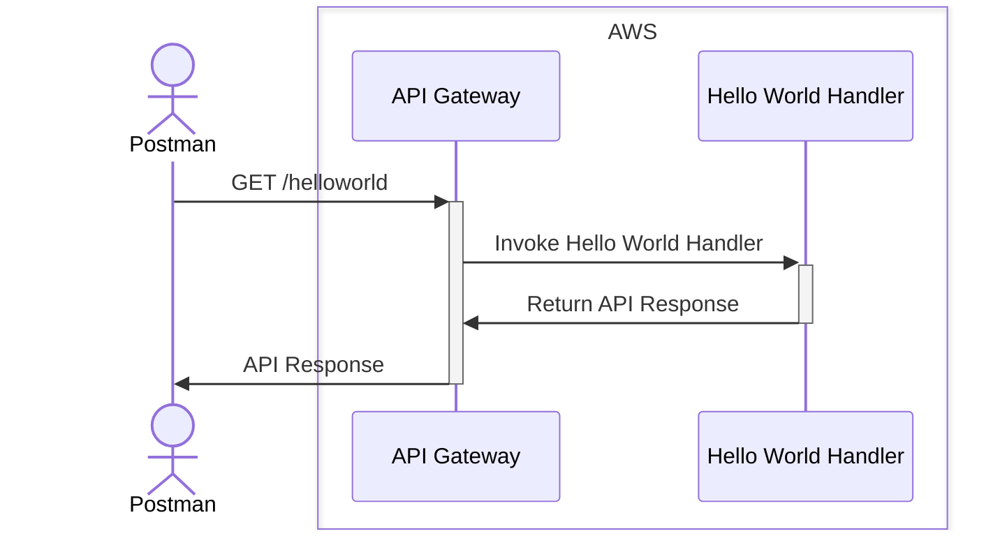

# Technical Design

- [Sequence Diagrams](#sequence-diagrams)
- [External Dependencies](#external-dependencies)

## Sequence Diagrams

## External Dependencies

| Name       | Version    | License | Purpose       |
|------------|------------|---------|---------------|
| [aws-lambda](https://www.npmjs.com/package/aws-lambda) | ^1.0.7 | [MIT](https://github.com/awspilot/cli-lambda-deploy/blob/master/LICENSE) | AWS Lambda SDK |
| [aws-sdk](https://www.npmjs.com/package/aws-sdk)| ^2.1359.0 | [Apache-2.0](https://github.com/aws/aws-sdk-js/blob/master/LICENSE.txt) | AWS SDK       |
| [dotenv-cli](https://www.npmjs.com/package/dotenv-cli) | ^7.3.0 | [MIT](https://github.com/entropitor/dotenv-cli/blob/master/LICENSE) | Load environment variables from .env files |
| [pino](https://www.npmjs.com/package/pino) | ^8.19.0 | [MIT](https://github.com/pinojs/pino/blob/master/LICENSE) | Logging library |
