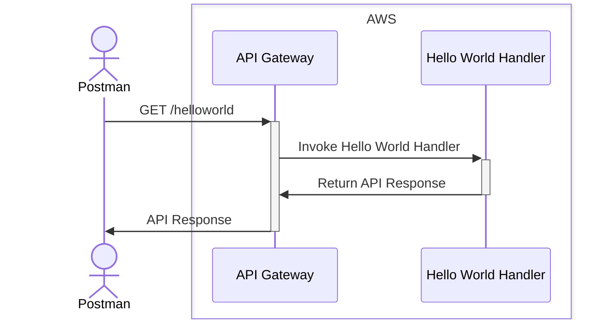

# Technical Design

- [APIs](#apis)
- [Environment](#environment)
- [External Dependencies](#external-dependencies)

## Sequence Diagrams

## External Dependencies

| Name       | Version    | License | Purpose       |
|------------|------------|---------|---------------|
| [aws-lambda](https://www.npmjs.com/package/aws-lambda) | ^1.0.7 | [MIT](https://github.com/awspilot/cli-lambda-deploy/blob/master/LICENSE) | AWS Lambda SDK |
| [aws-sdk](https://www.npmjs.com/package/aws-sdk)| ^2.1359.0 | [Apache-2.0](https://github.com/aws/aws-sdk-js/blob/master/LICENSE.txt) | AWS SDK       |
| [dotenv-cli](https://www.npmjs.com/package/dotenv-cli) | ^7.3.0 | [MIT](https://github.com/entropitor/dotenv-cli/blob/master/LICENSE) | Load environment variables from .env files |
| [pino](https://www.npmjs.com/package/pino) | ^8.19.0 | [MIT](https://github.com/pinojs/pino/blob/master/LICENSE) | Logging library |

### External Dev Dependencies

| Name            | Version       | License | Purpose                        |
|-----------------|---------------|---------|--------------------------------|
| [@types/aws-lambda](https://www.npmjs.com/package/@types/aws-lambda) | ^8.10.114  | [MIT](https://github.com/DefinitelyTyped/DefinitelyTyped/blob/master/LICENSE) | TypeScript definitions for AWS Lambda |
| [@types/jest](https://www.npmjs.com/package/@types/jest) | ^29.5.12 | [MIT](https://github.com/DefinitelyTyped/DefinitelyTyped/blob/master/LICENSE) | TypeScript definitions for Jest |
| [@types/node](https://www.npmjs.com/package/@types/node)       | ^18.16.2   | [MIT](https://github.com/DefinitelyTyped/DefinitelyTyped/blob/master/LICENSE) | TypeScript definitions for Node.js |
| [@types/supertest](https://www.npmjs.com/package/@types/supertest)       | ^6.0.2   | [MIT](https://github.com/DefinitelyTyped/DefinitelyTyped/blob/master/LICENSE) | TypeScript definitions for supertest |
| [dotenv](https://www.npmjs.com/package/dotenv) | ^16.0.3    | [BSD-2-Clause](https://github.com/motdotla/dotenv/blob/master/LICENSE) | Load environment variables from .env files |
| [Jest](https://www.npmjs.com/package/jest) | ^29.7.0 | [MIT](https://github.com/jestjs/jest/blob/main/LICENSE) | JavaScript Testing |
| [serverless-offline](https://www.npmjs.com/package/serverless-offline?activeTab=readme) | ^12.0.4   |     [MIT](https://github.com/dherault/serverless-offline/blob/master/LICENSE)    | Emulate AWS Lambda and API Gateway locally |
| [supertest](https://www.npmjs.com/package/supertest)       | ^6.3.4   | [MIT](https://github.com/ladjs/supertest/blob/master/LICENSE) |  high-level abstraction for testing HTTP |
| [ts-node](https://www.npmjs.com/package/ts-node) | ^10.9.1 | [MIT](https://github.com/TypeStrong/ts-node/blob/main/LICENSE) | TypeScript execution environment for Node.js |
| [typescript](https://www.npmjs.com/package/typescript) | ^5.3.2 | [Apache-2.0](https://github.com/microsoft/TypeScript/blob/main/LICENSE.txt) | TypeScript language compiler |
